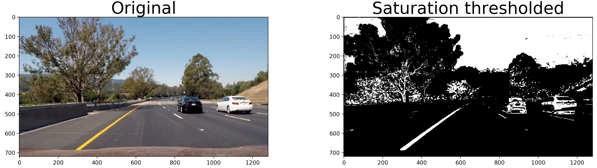
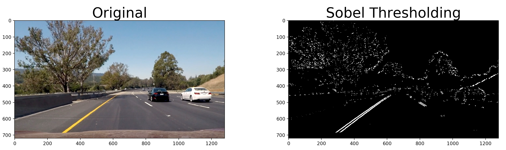
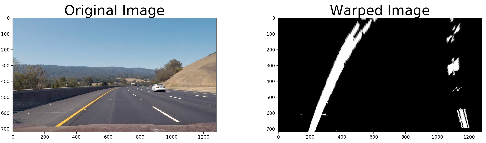
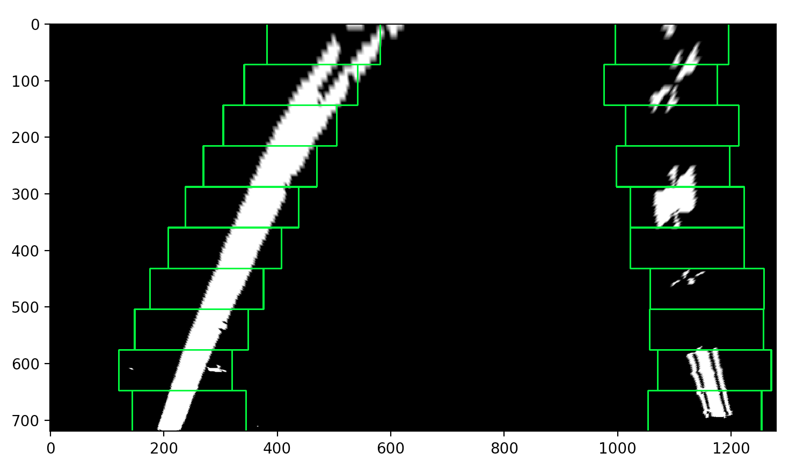
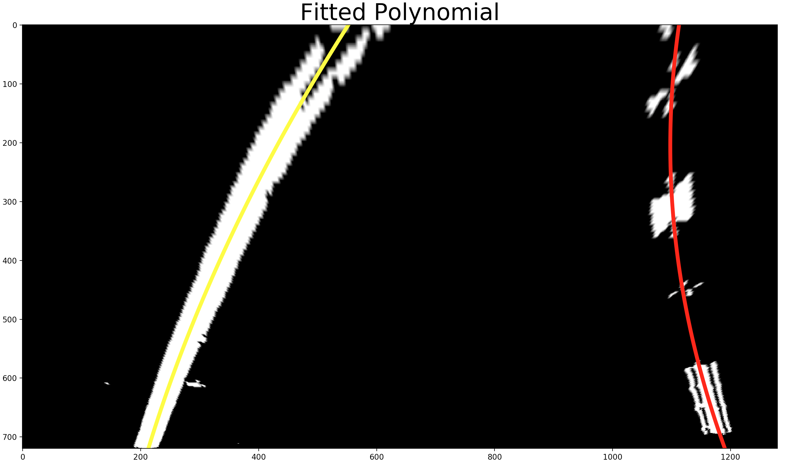

# Advanced Lane Finding

1. Calibrated Camera Result
   
2. Saturation Thresholded Image Result
   
3. Sobel Edge Detection with Maginitude and Gradient Thresholding Result
   
4. Combined thresholding (Saturation Color Space | Sobel Thresholding)
   
5. Perspective Transform Result
   
6. Histogram Calculation Result
   
7. Lane Pixels Result
   
8. Fitted Polynomial Result
   
9. Lane Lines and Polygon Result
   
10. Final Result on an Image
    
11. Pipeline Result on a Video
    [Output Video](./output_video.mp4)