# **Advanced Lane Finding**
To find the lanes in the video for this project, the scripts are divided into many different functions. 
The pipeline to determine the lanes is coded in `./code/main.py`. In this script the other functions part of the pipeline are called in the desired order.

Separate to the main function, another function `cal_camera` is written in the fine `./code/cal_camera.py`. This function is used to calibrate the camera and determine the camera and distortion matrix.

This write up includes the following topics
- [**Advanced Lane Finding**](#advanced-lane-finding)
  - [Camera Calibration](#camera-calibration)
  - [Pipeline (single images)](#pipeline-single-images)
    - [1. Calibration of the camera](#1-calibration-of-the-camera)
    - [2. Thresholding the undistorted image](#2-thresholding-the-undistorted-image)
    - [3. Perspective Transform](#3-perspective-transform)
    - [4. Finding the Lane Pixels](#4-finding-the-lane-pixels)
    - [5. Fitting a polynomial](#5-fitting-a-polynomial)
    - [6. Calculating the offset of the vehicle (w.r.t Center of the Image) and the curvature of the lane](#6-calculating-the-offset-of-the-vehicle-wrt-center-of-the-image-and-the-curvature-of-the-lane)
    - [7. Plot the lane lines](#7-plot-the-lane-lines)
    - [8. Add the curvature and offset to the image](#8-add-the-curvature-and-offset-to-the-image)
  - [Pipeline (video)](#pipeline-video)
  - [Discussion](#discussion)
    - [Problems faced](#problems-faced)
    - [Places which can be imporved](#places-which-can-be-imporved)

## Camera Calibration
- File - *./code/cal_camera.py*
- Function - `cal_camera(<path to calibration images>, <number of squares in x-direction>, <number of squares in y-direction>)`

Followitg are the steps performed in the function for camera calibration
1. The function reads the calibration images one by one the `glob` library in python.
2. Create a Zero array of data type float32 using the numpy.zeros command. Reshape the zero array to create the opject points array. The number of squares in x-direction is chosen as 9 and in y-direction is chosen as 5.
3. Create empty lists for object points and image points.
4. Loop through the calibration images and perform the following steps for each of the image.
5. Read the image and get the shape of the image
6. Convert the image to gray scale color space
7. Using the open cv functin `cv2.findChessCorners`, get the corners in the calibration image
8. Append the found corners to the image points.
9. Using the open cv function `cv2.calibrrateCamera`, get the camera matrix and the distortion matrix (others are also calculated but are not important for the camera calibration)
10. Return the camera matrix and the distortion matrix.

In the following image, the first image is the original image, the second image is the gray scale image, the third image is with the corners found and the last image is the undistorted image.
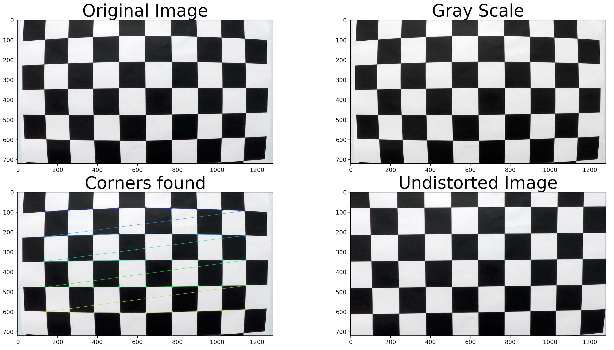

This function is called in the `main.py` if the calibration matrices are not stored in a pickled file.

## Pipeline (single images)

### 1. Calibration of the camera
The first step in the pipeline is to calibrate the camera. If there is no pickled file, containing the camera matrix and the distortion matrix, stored in the folder then the `cal_camera()` function is called. Otherwise the matrices are read form the pickled file. 
After reading the matrices, the loaded image is undistorted and the result is show in the image below.
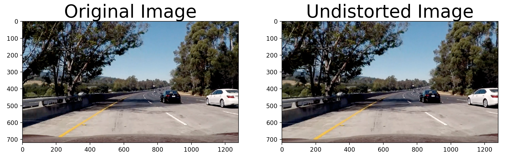

### 2. Thresholding the undistorted image
Thresholding is done in two stages,
1. Using the HSL Color Space
2. Using the magnitude and gradient (sobel edge dection)

The code for thresholding is written in the file `./code/threshold.py`. In the file there are three functions. The functions are explained below
1. `threshold_hsl(<raw image>, <minimum value for thresholding>)`
   - The function first converts the raw image into the HSL Color Space.
   - The color space is divided into the three channels and stored in three variables.
   - A blank (black) canvas is created using `np.zeros` with the same size as the original image but with only one channel.
   - The areas of the image where the **Saturation** channel is greater than the minimum threshold provided in the function is set to one.
   - The thresholded image is returned.
   
   An example of Saturation based thresholding is shown in the image below. **The minimum value of Saturation for thresholding is chosen as 100 for lane detection.**
   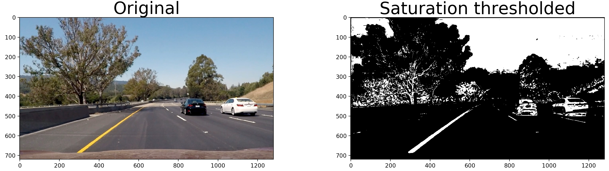
2. `threshold_sobel(<image>, <sobel kernel size>, <magnitude threshold (min, max)>, <gradient threshold (min, max)>)`
    - The image is converted to gray scale color space
    - The sobel gradients in x and y direction are calculated, and also the absolute values of the gradients are calculated.
    - Based on the x and y gradients, the magnitude is calculated
    - The magnitude is then scaled to the rance 0-255
    - Based on the magnitude thresholds provided in the funciton, the coordinates with values within the min and max for threshold are set to 1 and rest are set to 0.
    - Now based on the absolute values of gardients in x and y direction, the inveerse tan is calculated which determnines the direction of the gradient.
    - Direction of the gradient is also thresholded. The coordinates with values between the max and min of the gradient threshold are set to 1 in a blank canvas and rest are set to 0.
    - A new canvas is created where all the values are set to 0. In this canvas the values at those coordinates is set to 1, where the value of thresholded magnitude and thresholded direction of gradient is 1. Basically a bitwise and between the thresholded magnitude and thresholded gradient.
    - The canvas is returned.
    An example of the thresholded edge detection is shown below. **For the lane detection the kernel size is set to 15, the range for magnitude thresholding is set to 50-190 and for the gradient thresholding is set to 0.7-1.2.**
    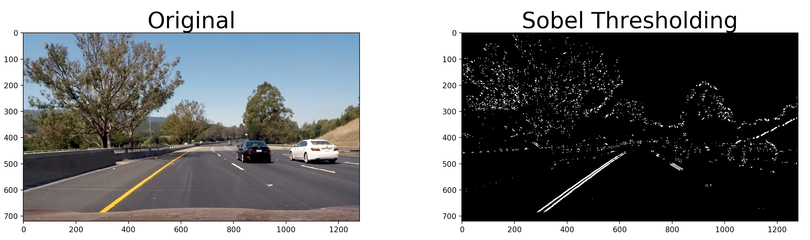
3. `threshold_combined(<hsl thresholded>, <sobel thresholded>)`
    - The Saturation thresholded image and the Sobel thresholded image is passed on to this function to caluclate the combined thresholding.
    - A blank canvas is created of the same size of the image with one channel.
    - At the coordinates, where the saturation thresholded image or the sobel thresholded image is 1, the value is set to 1 in the blank canvas.
    - It is like taking a bitwise or between the two thresholded images.
    An example of the combined thresholded image is shown below.
    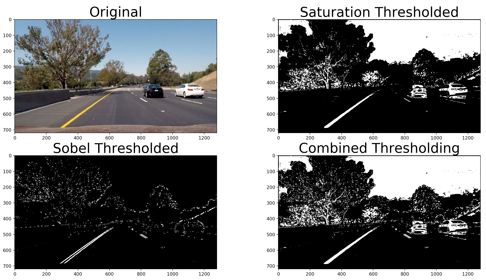

### 3. Perspective Transform
The next step in the pipeline is to do a perspective transform to get the birds eye view. To this the following source and destination points were taken for all the images.

| Source        | Destination   | 
|:-------------:|:-------------:| 
| 170, 700      | 100, 720      | 
| 550, 450      | 100, 0        |
| 750, 450      | 1280, 0       |
| 1200, 700     | 1280, 720     |

The code for perspective transform is written as a function in `./code/perspective_transform.py`. The function is called as follows `perspective_transform(<undistorted image>, <source points>, <destination points>)`. The function return a warped image, a transformation matrix and a inverse transformation matrix. 

These coordinates were tested on a test image, the result with the original image is shown below.
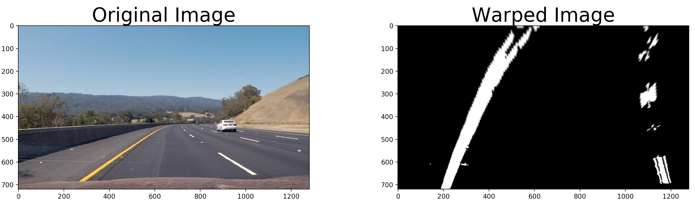

### 4. Finding the Lane Pixels
The next step in the pipeline is to find the coordinates of the lane pixels in the warped image. The code for finding the lane pixels is written in `./code/histogram_lane_pixels.py`. The file contains two functions
- `find_lane_pixels(<warped binary image>, <number of windows>, <margin>, <minimum number of pixels>)`
- `search_around_poly(<warped binary image>, <coordinates for left fit>, <coordinates for right fit>, <margin>)`

For the current implementation, only the first function is used as it is giving acceptable resutls in the Project Video. For the challenging videos, the second has to be used to find the pixels more accurately.

To find the lane pixels the following steps are taken (coded in the function `find_lane_pixels()`)
1. Create a histogram of the bottom 1/4th of the binary warped image. As shown in the image below
    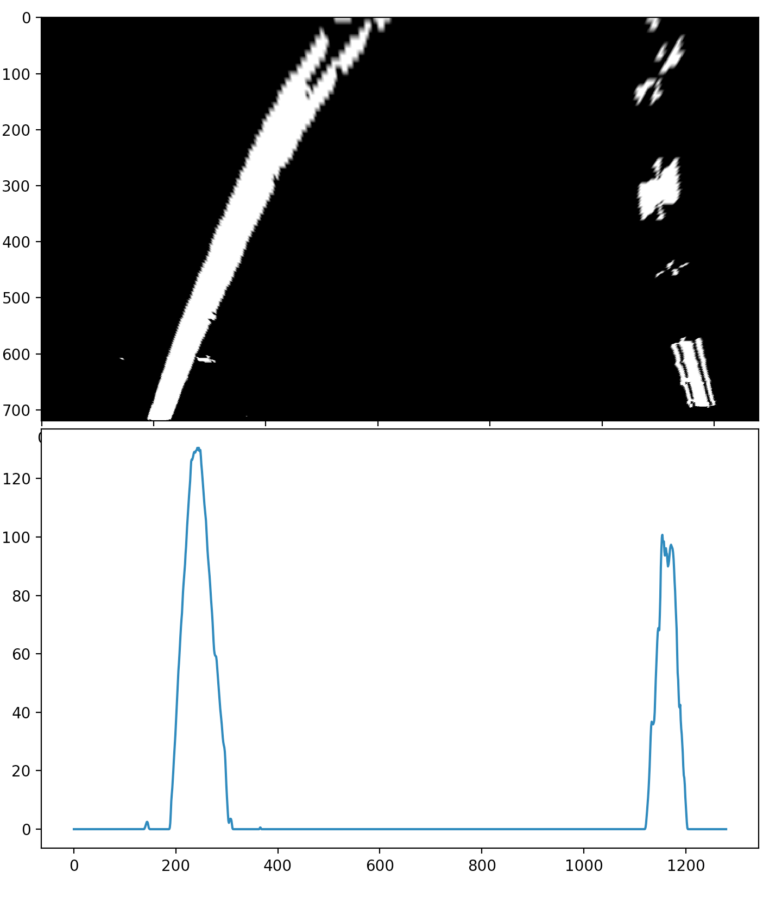
2. Create an output image, to be modified later, by stacking the binary warped image.
3. Find the left and right peaks in the histogram by finding the maximum on the left and right side of the image.
4. Calculate the heifht of the windows that will be used to find tha lane pixels depending on the numnber of windows passed into the function. Height = (Height of the image)/(number of windows)
5. Create an array called `nonzero` where all coordinates with the value is 1 in the binary warped image is set to True.
6. From the `nonzero` array, extrace the array for non zero in x direction and non zero in y direction.
7. Create a starting point for the left and right side respectively.
8. Create two empty lists `left_lane_inds` and `right_lane_inds` where the coordinates for left and right lane pixels will be appended.
9. Loop through the number of windows
    - Calculate the coordinates for the window (win_y_low, win_y_high), (win_xleft_low, win_xleft_high), (win_xright_low, win_xright_high) for the left and right side of the image.
    - Draw the windows on to the out image with green color.
    - Find the coordinates for the non-zero pixels which are within the rectangle and save them to a variable. This is done for both left and right side of the image.
    - Append these coordiantes to `left_lane_inds` and `right_lane_inds`.
    - If the pixels found are greater than the miminum number of poxels passed to this function, then calculate the mean of the x coordinates of the found pixels and update the `leftx_current` and `rightx_current`.
    - With the help of `left_lane_inds` and `right_lane_inds` extract the left and right x, y coordinates and return with the output image.
An example of the output image is as follows
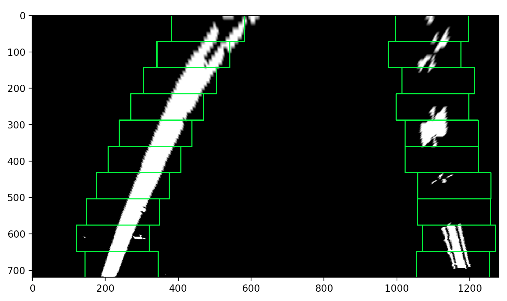

### 5. Fitting a polynomial
Fitting a polynomial to the pixels found in the above step is done in lines from 58 to 65 in the `./code/main.py` file. The fitting of polynomial is done using the numpy `polyfit()` function. The polynomial fitted is of 2nd order. Separate polynomials are generated for the left left lane and the right lane using the coordinates found for the lane pixels. An example of the fitted polynomial is following
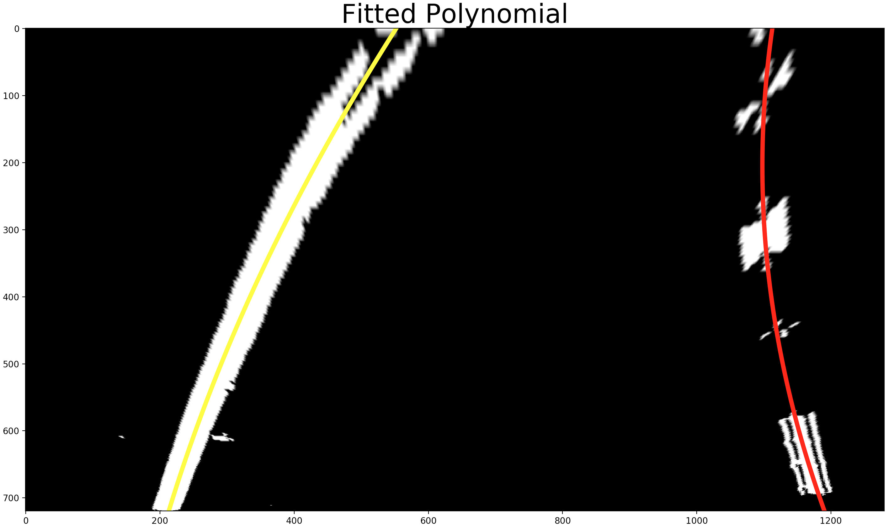

### 6. Calculating the offset of the vehicle (w.r.t Center of the Image) and the curvature of the lane
The calculation of the the offset and the curvature of the lane (left and right) are done in the line from 71-77 in the file `.code/main.py`. In order to calculate the the curvature and the offset, first two hyperparameters are defined
- Meters per pixel in y-direction : 30/720 (Relevant pixels in the y direction = 720)
- Meters per pixel in x-direction : 3.7/700 (Relevant pixels in the x direction = 700)

Using the above defined parameters and the lane coordinates, the curvature is calculated as follows
`left_curve_rad = ((1 + (2*coeff_left_A*y_eval*ym_per_pix + coeff_left__B)**2)**1.5)/np.absolute(2*coeff_left_A)`
`right_curve_rad = ((1 + (2*coeff_right_A*y_eval*ym_per_pix + coeff_right_B)**2)**1.5)/np.absolute(2*coeff_right_A)`
*Same formula as used in the quiz* 

The offset of the car from the center of the image is calculated using the following formula
`offset = (mid_point_image_width - mean_of_left_and_right_lane_x_direction*xm_per_pix`

### 7. Plot the lane lines
Once all the calculations are done the lane lines need to be drawn on the image. This is done in the function `color_lane()` written in `./code/draw_lane_lines.py` file.
The function takes the following inputs
- Original Image
- Warped binary image
- X, Y points of the fitted polynomial for the left lane line
- X, Y points of the fitted polynomial for the right lane line
- Coordinates of the detected left lane pixel
- Coordinates of the detected right lane pixel
- The transformation matrix

The function performs the following steps
1. Create a black canvas of the same size and data type as the original image
2. Stack the canvas so that it has 3 color channels using `numpy.dstack()` function
3. In order to create a filled polygon, the left and right points (X, Y) array needs to be reshaped. The reshaping is done in the lines 10-12 in file `./code/draw_lane_lines.py`
4. Once the reshaping is done a filled polygon is created on the canvas using `cv2.fillPoly()` function with Blue color.
5. Also the left and right lane pixels are colored using the coordinates passed on to this function. The left lane pixels are marked with red and right lane pixels are marked with green.
6. Now that the lane line and the pixels are drawn on the canvas, the canvas is inverse transformed with the help of the transformation matrix passed to this function.
7. The unwarped canvas is added to the original image using the `cv2.addWeighted()` function with `alphe = 1` and `gamma - 0.3`
8. This is the returned from the function.

The returned image looks as follows
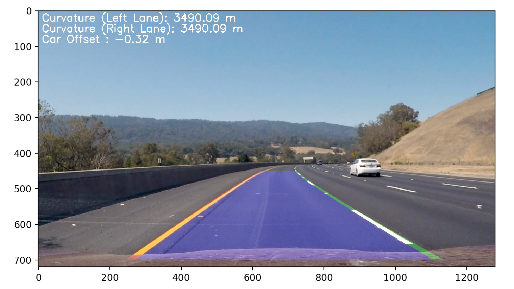

### 8. Add the curvature and offset to the image
After plotting the lane lines and drawing a filled polygon, on the image the following text is added.
- Curvature (Left Lane) 
- Curvature (Right Lane)
- Car Offset
The values of the above mentioned is calculated in step 6 in this document. The text and the corrosponding values are added to the image using the `cv2.putText()` funciton. The function is used in the document `./code/main.py` in the lines from 91 to 113.

Once the above mentioned steps are done the final image looks like the following image
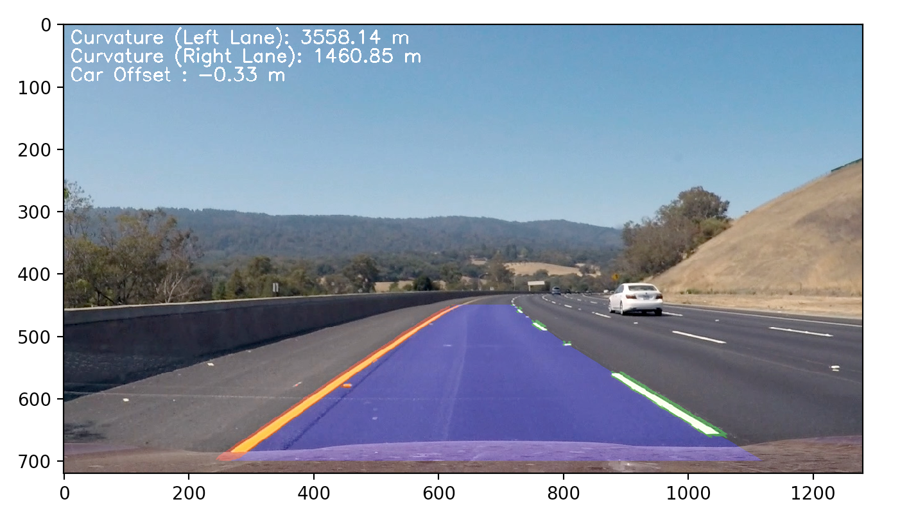

## Pipeline (video)
In order to detect lane lines, the same pipeline, as done for the image, is applied to every frame in the video.
But in order to do that, the video needs to be loaded and a loop needs to be created that will loop over every frame in the video. To do this the following steps are take which are coded in `./code/main.py` in the lines from 145-195. The steps are as follows
1. Load the video using `cv2.VideoCapture()` function by providing the path to the video.
2. Get the Height, width, frames/second and the length of the video.
3. Start the loop over every frame of the video
    - Read the frame using the method of the video class `video.read()`
    - Call the function `find_lanes()`. Within this the entire pipeline for lane detection is coded. The funciton is in the `./code/main.py` file.

## Discussion
### Problems faced
Following are the porblems I face while implementing the pipeline
1. Determining the minimum thresholding whicle doing HSL color space thresholding. It was a hit and trial method which took some time.
2. Determining the magnitude and gradient thresholding values while using the sobel edge detecting. Again hit and trial method was used to determine approximate values which work and is very time consuming.
3. Getting the right shapes of the arrays for different function was very time consuming and also understanding the different numpy function sfor reshaping and creating the arrays is very confusing.

### Places which can be imporved
1. The thresholding fails when there is sudden change in the lighting condition.
2. Usage of search around the polynomial will help improve the detection of the lane lines.
3. Implementation of Line class properly and use it to determine the lane lines when nothing is detected.
